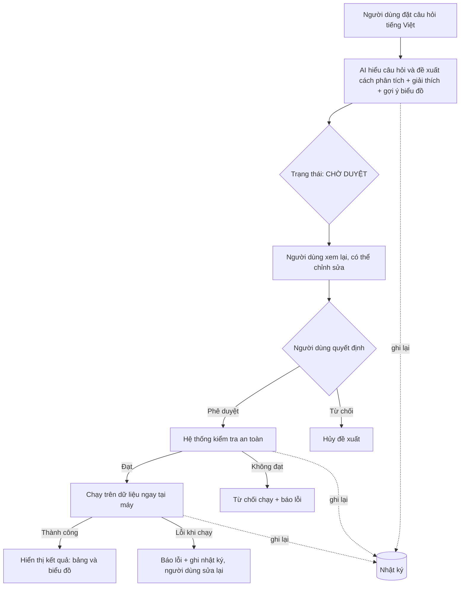

# Chức năng AI trong Vietnam Climate Pulse — Luồng hoạt động

> Tài liệu giải thích **cách trợ lý AI hoạt động** trong đồ án, tập trung vào luồng vận hành và các nguyên tắc an toàn.

---

## 1. Trợ lý AI làm gì?

Trợ lý AI cho phép người dùng **đặt câu hỏi về dữ liệu khí hậu bằng tiếng Việt**, thay vì phải tự viết truy vấn. AI sẽ **hiểu câu hỏi và tự soạn ra cách phân tích tương ứng**, kèm lời giải thích dễ hiểu.

Điểm mấu chốt: **AI chỉ đề xuất, con người là người quyết định.** AI không tự ý chạy bất cứ thứ gì — người dùng phải xem, có thể chỉnh sửa, rồi bấm phê duyệt thì kết quả mới được tính toán. Đây gọi là mô hình **"con người trong vòng lặp" (Human-in-the-loop)**.

---

## 2. Luồng hoạt động tổng quát

---

## 3. Diễn giải từng bước

### Bước 1 — Đặt câu hỏi
Người dùng chọn kiểu phân tích (SQL hoặc Python) và gõ câu hỏi, ví dụ: *"So sánh nhiệt độ trung bình giữa ba miền."*

### Bước 2 — AI đề xuất
AI trả về **đoạn phân tích**, **lời giải thích tiếng Việt**, và **gợi ý loại biểu đồ** để hiển thị (xem mục 7). Lúc này đề xuất ở trạng thái **"Chờ duyệt"** — **chưa hề chạy gì**. Nếu câu hỏi ngoài chủ đề khí hậu, AI **lịch sự từ chối**.

### Bước 3 — Người dùng xem và chỉnh sửa
Đoạn phân tích được **hiển thị công khai**; người dùng có thể **sửa trực tiếp** nếu chưa đúng ý.

### Bước 4 — Phê duyệt và kiểm tra an toàn
Khi bấm **"Phê duyệt & chạy local"**, hệ thống **tự kiểm tra an toàn** (xem mục 6). Nếu phát hiện thao tác nguy hiểm, **từ chối chạy**.

### Bước 5 — Chạy tại máy và trả kết quả
Sau khi đạt kiểm tra, đoạn phân tích chạy **ngay trên máy cục bộ**, trực tiếp trên dữ liệu, **không gửi ra online**. Kết quả hiện dưới dạng **bảng và biểu đồ**.

### Bước 6 — Lưu lại toàn bộ
Mọi bước — câu hỏi, đề xuất ban đầu, phần chỉnh sửa, kết quả — đều được **ghi vào nhật ký** để xem lại.

---

## 4. Hệ thống gọi AI như thế nào?

Phần này giải thích điều xảy ra "phía sau" ở Bước 2.

**Ai gọi AI?** Chỉ có **máy chủ (backend)** gọi tới dịch vụ AI, còn **giao diện (frontend) không bao giờ trực tiếp gọi**. Nhờ đó, khóa bí mật của AI không lộ ra trình duyệt người dùng.

**Khóa API quản lý ra sao?** Khóa truy cập Google Gemini được đặt trong một **tệp cấu hình môi trường riêng** trên máy chủ (không viết cứng trong mã, không đẩy lên GitHub). Khi khởi động, máy chủ đọc khóa này. Nếu **không có khóa**, hệ thống tự chuyển sang **chế độ ngoại tuyến (offline)** để demo vẫn chạy.

**Một lượt gọi gồm gì?** Máy chủ gửi tới Gemini ba thứ:
1. **Bản chỉ dẫn (system prompt)** — bối cảnh dữ liệu + quy tắc (xem mục 5);
2. **Câu hỏi** của người dùng;
3. **Yêu cầu định dạng trả về** — buộc AI trả lời gọn gồm: *đoạn phân tích*, *lời giải thích*, và *gợi ý biểu đồ*.

> Đáp ứng yêu cầu đề: *"API AI nhận yêu cầu, gửi kèm ngữ cảnh (cấu trúc dữ liệu) cho mô hình, và trả về cả code lẫn giải thích."*

---

## 5. Bản chỉ dẫn gửi cho AI (ngữ cảnh & quy tắc)

Trước mỗi câu hỏi, hệ thống luôn gửi kèm một **"bản hướng dẫn"** để AI hiểu đúng dữ liệu:

**a) Mô tả bộ dữ liệu (ngữ cảnh):**
- **Danh sách đầy đủ các cột** cùng ý nghĩa, đơn vị: ngày, địa điểm, vùng miền, kinh/vĩ độ, nhiệt độ cao nhất/thấp nhất/trung bình (°C), lượng mưa (mm), sức gió (km/h), bức xạ mặt trời (MJ/m²).
- **Danh sách 28 trạm**, lưu ý tên lưu bằng **tiếng Anh không dấu** (vd "Da Lat", "Hue"), kèm **quy tắc ánh xạ**: "Đà Lạt" → `Da Lat`, "Sài Gòn/HCM" → `Ho Chi Minh City`…
- Ba giá trị vùng miền hợp lệ và **khoảng thời gian** dữ liệu (2020–2025).

**b) Các quy tắc bắt buộc:**
- Chỉ được tạo **thao tác đọc dữ liệu**, không tạo thao tác xóa/sửa.
- **Luôn kèm lời giải thích tiếng Việt.**
- Nếu câu hỏi **không liên quan** khí hậu → **từ chối**, không bịa phân tích.

---

## 6. Chính sách kiểm soát an toàn (Guardrails)

Bản chỉ dẫn ở mục 5 chỉ là "dặn dò" AI. Để chắc chắn tuyệt đối, hệ thống có thêm **một lớp kiểm tra độc lập** chạy **sau khi con người bấm duyệt và trước khi chạy** — dù AI hay con người có cố đưa thao tác xấu vào thì lớp này vẫn chặn.

### Với truy vấn SQL
- **Chỉ chấp nhận câu lệnh đọc**; mọi thứ khác bị từ chối.
- **Danh sách cấm:** chặn hoàn toàn các thao tác *thêm, sửa, xóa, xóa bảng, đổi cấu trúc, sao chép*…
- **Chỉ một câu lệnh mỗi lần** — ngăn chèn nhiều lệnh nối tiếp để lách luật.

### Với phân tích Python
- **Cấm tải thêm thư viện.**
- **Cấm các lệnh nguy hiểm** truy cập máy tính, tệp tin hay mạng.
- **Cấm các "mẹo" lách sandbox.**
- Chạy trong **môi trường cô lập** chỉ được tính toán trên dữ liệu đã nạp và một số phép cơ bản (đếm, tổng, trung bình, sắp xếp…). **Không đọc/ghi tệp, không gọi mạng.**
- Kết quả **giới hạn tối đa 500 dòng**.

### Vì sao cần cả hai lớp?
- **Bản chỉ dẫn (mục 5)** giúp AI *có xu hướng* làm đúng.
- **Guard (mục 6)** là *rào chắn cứng* — kể cả khi bước trên sai sót, dữ liệu gốc vẫn được bảo vệ tuyệt đối.

→ Hiện thực nguyên tắc **"không thực thi ngầm"** và **"AI không được tự ý thay đổi dữ liệu gốc"**.

---

## 7. AI còn gợi ý biểu đồ để hiển thị kết quả

Ngoài đoạn phân tích và giải thích, AI còn **đề xuất loại biểu đồ phù hợp** với câu hỏi — ví dụ biểu đồ **cột** để so sánh, biểu đồ **đường** để xem xu hướng theo thời gian, biểu đồ **phân tán** để xem quan hệ hai biến — kèm việc chỉ ra dùng cột nào làm trục ngang, cột nào làm trục dọc.

Nhờ vậy, sau khi chạy, kết quả không chỉ hiện dưới dạng bảng số mà còn được **vẽ thành biểu đồ trực quan** ngay. Người dùng có thể chuyển đổi giữa xem bảng và xem biểu đồ.

→ Đáp ứng yêu cầu đề: *"AI trình bày kết quả phân tích với số liệu **và hình ảnh, biểu đồ**"* — với lưu ý hình ảnh được vẽ từ **số liệu thật do hệ thống tính**, không phải AI tự tạo.

---

## 8. Khi chạy gặp lỗi thì sao?

Có trường hợp đoạn phân tích vượt qua kiểm tra an toàn nhưng khi chạy vẫn lỗi — ví dụ tên cột gõ sai, phép tính không hợp lệ. Khi đó hệ thống **không bị treo**: nó **báo lỗi rõ ràng** cho người dùng, đồng thời **ghi vào nhật ký với trạng thái "thất bại"** kèm nội dung lỗi. Người dùng chỉ cần **sửa lại đoạn phân tích rồi chạy lại**. Điều này cho thấy hệ thống xử lý lỗi đàng hoàng và luôn giữ dấu vết đầy đủ.

---

## 9. Vài điểm đáng chú ý

**Mô hình AI:** dùng **Google Gemini**, kèm **chế độ dự phòng ngoại tuyến** để luôn hoạt động khi mất mạng.

**Hai kiểu phân tích:** **SQL** (lọc, gom nhóm, xếp hạng nhanh) và **Python** (phân tích phức tạp hơn) — cả hai đi qua đúng luồng phê duyệt.

**AI không bịa số liệu:** mọi con số trong kết quả đều tính từ dữ liệu thật.

---

## 10. Vì sao thiết kế theo cách này?

Nhóm chọn hướng "AI sinh phân tích cho con người duyệt" thay vì "AI trả lời thẳng con số", vì ba lý do:

- **Minh bạch:** người dùng thấy chính xác *phép tính nào* tạo ra con số, chứ không phải tin AI một cách mù quáng.
- **Kiểm chứng được:** ai cũng có thể đọc lại đoạn phân tích để xác nhận đúng/sai, và sửa nếu cần.
- **Tái lập được:** cùng một đoạn phân tích luôn cho cùng kết quả trên cùng bộ dữ liệu.

Đây cũng là lý do có bước **phê duyệt**: nó vừa đảm bảo an toàn, vừa buộc con người chịu trách nhiệm cuối cùng cho kết quả — đúng tinh thần đề bài.

---

## 11. Hạn chế của trợ lý AI (nhìn nhận thẳng thắn)

- **Xử lý từng câu hỏi độc lập:** trợ lý không nhớ ngữ cảnh câu hỏi trước, nên mỗi câu cần diễn đạt đủ ý — nó không phải một chatbot hội thoại nhiều lượt.
- **Phụ thuộc chất lượng mô hình:** đôi khi AI có thể chọn tên cột chưa khớp hoặc điều kiện lọc chưa tối ưu — và đây chính là lý do **bước con người xem & sửa** là bắt buộc, không thể bỏ.
- **Chế độ ngoại tuyến hạn chế:** khi không có mạng, trợ lý chỉ trả lời được một số câu hỏi mẫu quen thuộc, không linh hoạt như khi có kết nối.

Những hạn chế này được kiểm soát bằng chính cơ chế human-in-the-loop: AI sai thì con người phát hiện và sửa trước khi chạy.

---

## 12. Ví dụ thực tế

### Ví dụ A — AI đề xuất đúng ngay
1. **Người dùng hỏi:** *"So sánh nhiệt độ trung bình giữa ba miền Bắc, Trung, Nam."*
2. **AI đề xuất** cách tính nhiệt độ trung bình theo miền + giải thích + gợi ý biểu đồ cột → **Chờ duyệt**.
3. **Người dùng** thấy hợp lý, bấm **Phê duyệt & chạy local**.
4. Hệ thống kiểm tra an toàn → đạt → chạy.
5. **Kết quả:** miền Nam nóng nhất → miền Trung → miền Bắc, hiện bảng và biểu đồ.
6. **Nhật ký** ghi: chờ duyệt → phê duyệt → đã chạy.

### Ví dụ B — Con người sửa lại đề xuất của AI (thể hiện rõ human-in-the-loop)
1. **Người dùng hỏi:** *"Tìm những ngày nhiệt độ bất thường tại Hà Nội."*
2. **AI đề xuất** lọc theo **nhiệt độ trung bình của cả tháng** vượt 38 độ.
3. **Con người nhận ra** cách này chưa đúng: trung bình cả tháng hiếm khi vượt 38 độ, nên sẽ bỏ sót. Người dùng **sửa lại** thành lọc theo **nhiệt độ của từng ngày** vượt 38 độ.
4. Sau khi sửa, phê duyệt và chạy → ra đúng **danh sách các ngày nắng nóng đỉnh điểm thật**.

→ Ví dụ này cho thấy giá trị của con người trong vòng lặp: AI hỗ trợ khung sườn, con người tinh chỉnh để ra kết quả chính xác.

---

## 13. Sẵn sàng cho buổi vấn đáp

Đề bài nêu rõ: trong vấn đáp, thầy/cô có thể **yêu cầu nhóm dùng trợ lý AI để trả lời câu hỏi tại chỗ**, kể cả những câu hỏi ngoài lề nhằm đánh giá mức độ linh hoạt.

Module đáp ứng được điều này: nhóm có thể **gõ bất kỳ câu hỏi khí hậu nào** và chạy trực tiếp; với câu hỏi **ngoài phạm vi** (không liên quan khí hậu), trợ lý sẽ **từ chối một cách hợp lý** thay vì bịa câu trả lời — cho thấy AI hoạt động có ranh giới rõ ràng.

---

## 14. Đối chiếu với yêu cầu tích hợp AI của đề

| Yêu cầu của đề | Cách đồ án đáp ứng |
|----------------|---------------------|
| AI gợi ý, viết phân tích, không bịa số liệu | AI chỉ đề xuất; số liệu lấy từ dữ liệu thật |
| Trình bày kết quả với số liệu **và hình ảnh** | AI gợi ý biểu đồ; kết quả vẽ từ số liệu thật (mục 7) |
| Con người định hướng và quyết định | Bắt buộc con người phê duyệt trước khi chạy |
| Thực thi tại máy cục bộ | Chạy trực tiếp trên máy, không online |
| Gửi kèm ngữ cảnh (cấu trúc dữ liệu) cho AI | Bản chỉ dẫn mô tả đầy đủ cột + trạm (mục 5) |
| Không thực thi ngầm (hiện rõ + giải thích) | Luôn hiển thị phân tích kèm giải thích ở trạng thái chờ duyệt |
| Nguyên tắc phê duyệt (chờ → sửa → chạy) | Đúng luồng: đề xuất → chỉnh sửa → phê duyệt & chạy |
| Nguyên tắc lưu trữ | Ghi nhật ký mọi bước (kể cả trạng thái thất bại) |
| Tách giao diện và dịch vụ AI/thực thi/nhật ký | Giao diện riêng; máy chủ giữ khóa AI; dịch vụ tách bạch |
| Bảo vệ dữ liệu gốc | Hai lớp: bản chỉ dẫn + guard kiểm tra độc lập (mục 6) |
| Dùng AI trả lời câu hỏi trong vấn đáp | Sẵn sàng chạy trực tiếp, biết từ chối câu ngoài lề (mục 13) |

---

*Tài liệu mô tả luồng hoạt động và nguyên tắc an toàn — không đi sâu vào chi tiết mã nguồn.*
